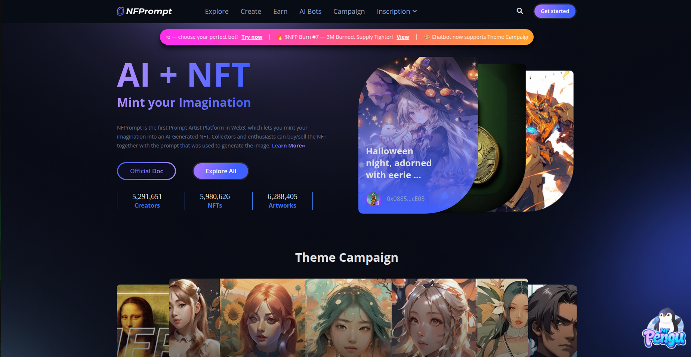
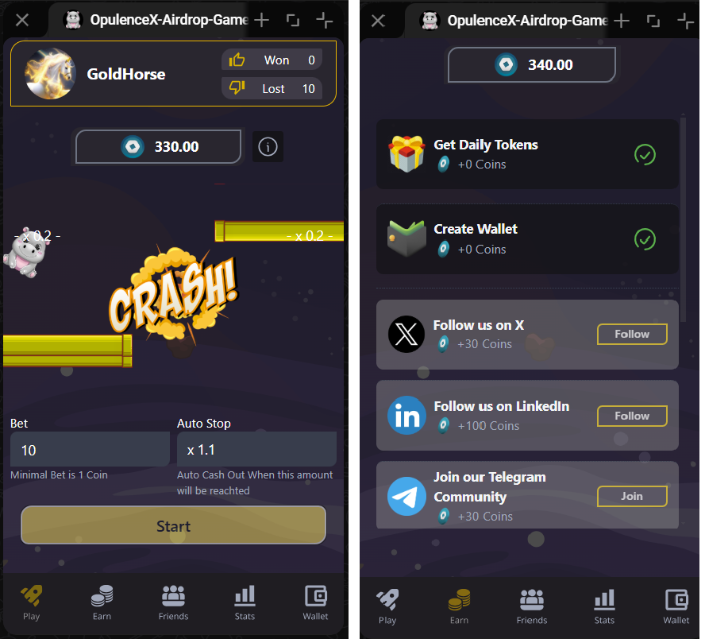

# ✌𝓟𝓻𝓮𝓿𝓲𝓸𝓾𝓼 𝓑𝓵𝓸𝓬𝓴𝓬𝓱𝓪𝓲𝓷 𝓟𝓻𝓸𝓳𝓮𝓬𝓽✌
#  ✅𝑪𝒐𝒏𝒕𝒂𝒄𝒕 𝒎𝒆:

 
    
    <!--  -->
    
    
    

        

As you can see here, I have built several NFT/Blockchain projects including NFT lending/borrowing, minting, staking, evolution/breeding features, raffle/auction houses, Launchpad, Marketplace, and P2E games(lootboxes, dice, crash, jackpot, coinflip, etc). All of repos are under private status.

<h3><u><strong><i> ✅ Perpetual Contract crypto Trading Platform on Ethereum</i></strong></u> &nbsp;- Trading Platform</h3>

PumpBit is a comprehensive crypto trading platform designed to facilitate perpetual contract trading on the B2 network and offer a staking feature for liquidity pools. The platform is built using Next.js for the frontend, Node.js for the backend, and utilizes Hardhat for smart contract development. The backend integrates with the Binance API to fetch real-time cryptocurrency prices.

- Live: <a href="https://testnet.pumpbit.io">Perpetual Contract crypto trading platform on B2 Network</a>
- fe-repo: <a href="https://github.com/touchsky000111/Crypto-Trading-Platform-EVM">DeFi on B2 Network</a>
- smart contract: <a href="https://github.com/touchsky000111/pumpbit-future-v2">Trading-smart-contract</a>

<h3><u><strong><i> ✅ Orbit Solana Trading Bot</i></strong></u> &nbsp;- Solana Volume Bot</h3>

Unlock the full potential of your trading strategy with Raydium Sniper Bot, the ultimate solution for seamless and automated trading on the Solana blockchain. Designed with speed, intelligence, and ease of use in mind, this tool empowers both novice and seasoned traders to stay ahead in the competitive crypto market.

- fe-repo: <a href="https://github.com/touchsky000111/Solana-Raydium-Sniper-Bot">Solana Raydium Sniper Bot</a>

<h3><u><strong><i> ✅ Staking Solana program</i></strong></u> &nbsp;- Rust smart contract</h3>

Check out this Ethereum contract, just for the use-case of the program: https://github.com/touchsky000111/Solana-Smart-Contract-DipHigh-Staking

This Solana program revolutionizes SPL-Token staking by leveraging Anchor 0.29.0 and Rust for robust smart contracts, paired with TypeScript for seamless client-side testing. Built on the Solana blockchain, it offers a secure, efficient, and scalable staking solution for users.

Resources

- Initialise PDA for SPL-Token that other Tokens should be linked to

<h3><u><strong><i> ✅ Solana Token Swap Platform</i></strong></u> &nbsp;- Dex Platform </h3>

This innovative platform revolutionizes SPL-Token trading by harnessing the power of Solana and Web3.js, providing a seamless and efficient swapping experience. Built with the latest Next.js version 14.0, it combines cutting-edge frontend capabilities with Solana's lightning-fast blockchain, ensuring fast, secure, and user-friendly transactions

- Live: <a href="https://spl-token-swap.vercel.app">DepHigh-Token-Swap</a>
- user-repo: <a href="https://github.com/touchsky000111/Solana-Spl-Token-Swap-Platform">DepHigh-Token-Swap</a>

<h3><u><strong><i> ✅ AI-NFT Marketing place</i></strong></u> &nbsp;- NFT Marketing place</h3>

This project is a smart contract for an NFT marketing place platform on Ethereum. Users can generate images with AI and then mint and collect them as NFTs.

- Live: <a href="https://tweet2earn.xyz">nfprompt.io</a>
- repo: <a href="https://github.com/touchsky000111/Ethereum-AI-NFT-Marketing-Place">AI-NFT Marketing place</a>

<h3><u><strong><i> ✅ Omnibus-Wallet-mMoney Platform</i></strong></u> &nbsp; - DeFi System</h3>

This service provides a comprehensive API for managing cryptocurrency wallets, handling transactions, and interacting with the Solana blockchain. Built with Rust and Axum, it offers high performance, type safety, and scalability for blockchain applications.

Features
- Wallet Management: Create, retrieve, update, and delete both virtual and blockchain wallets
- User Management: Associate wallets with users and manage user balances
- Transaction Processing: Create and track financial transactions between wallets
- Blockchain Integration: Interact with Solana blockchain for balance checking and wallet creation
- Balance Reconciliation: Track and reconcile on-chain and off-chain balances
- repo: <a href="https://github.com/touchsky000111/Omnibus-Wallet-mMoney/">Omnibus Wallet</a>

<h3><u><strong><i> ✅ Telegram mini app Game</i></strong></u> &nbsp; - Binance Smart Chain</h3>

 This innovative mini app seamlessly blends entertainment and opportunity, making it the perfect launchpad for our upcoming token. Don’t miss your chance to be part of a vibrant community and secure early access to valuable tokens. Join now and turn your gameplay into real-world gains!

- Front-end Framework: React Vite
- Back-end Framework: NodeJs
- Blockchain Network: Binance Smart Chain

- Live: <a href="https://justshift.io">JustShift</a>
- Fe-repo: <a href="https://github.com/touchsky000111/Opullenx-TG-mini-app-Bot-Backend">Telegram Mini app Game</a>

<h3><u><strong><i> ✅ Solana Mev Bot</i></strong></u> &nbsp; - Solana</h3>

This high-performance MEV bot delivers strategic edge through validator-node-level front-running, leveraging Solana's speed for real-time arbitrage and transaction pool dominance. Built exclusively for validator operators, it combines low-latency infrastructure with adaptive algorithms to optimize transaction ordering.

- Live: <a href="https://spritebox.art">Spritebox</a>
- Live backend: <a href="https://api.spritebox.art">Spritebox backend</a>
- Frontend repo: <a href="https://github.com/touchsky000111/spritebox">Spritebox-frontend</a>
- Backend repo: <a href="https://github.com/touchsky000111/sprite-box-backend">Spritebox-brontend</a>

<h3><u><strong><i> ✅ Pepe NFT Generate app</i></strong></u> &nbsp;(Ethereum)</h3>

This is a NFT Generate Project on Ethereum

Project was developed with NextJS@14 and the smart contract was developed with Hardhat framework and Solidity program language.
Token is ERC-721 and ERC-1155 standard in Openzepplin.

- Live: <a href="https://littlepepe.com">Pepe</a>
- Github repos: 
  - smart contract repo: <a href="https://github.com/touchsky000111/Ethereum-AI-NFT-Marketing-Place">Pepe NFT Smart Contract</a>
  - backend repo: <a href="https://github.com/touchsky000111/monopoly-backend">monopoly-backend</a>
  - frontend repo: <a href="https://github.com/touchsky000111/monopoly-frontend">monopoly-frontend</a>

<h3><u><strong><i> ✅ Bull Token Pre-sale Platform</i></strong></u> &nbsp;(Binance Smart Chain)</h3>

- Live: <a href="https://btcbulltoken.com/">BTCBullToken</a>
- Frontend repo: <a href="https://github.com/touchsky000111/BullBtc-Presale">BTCBullToken Front-end</a>
- Smart contract repo: <a href="https://github.com/touchsky000111/Ethereum-ERC-20-Staking-Contract">BTCBullToken Smart Contract</a>

<h3><u><strong><i> ✅ Fantasy Pepe</i></strong></u> &nbsp;(Ethereum)</h3>

This project is Presale and Staking Platform for Pepe coin on Ethereum and Binance Smart chaain

- Demo: <a href="https://fepe-site.vercel.app">Fantasy Pepe</a>
- Live: <a href="https://fantasypepe.com/">Fantasy Pepe</a>
  - Functionality
    - 500 NFTs
    - Mint price is 100 USDC
    - Need to put discord Name or Id
    - Avalanche network
- Testnet deployed contract address: <a href="https://testnet.snowtrace.io/address/0x80EEE1615feeD9c03aEbe94dCA6aDF1680cd41C6#code">Testnet contract</a>
- Mainnet deployed contract address: <a href="">Mainnet contract</a>
- Github repo:
  - Frontend: <a href="https://github.com/touchsky000111/Fantasy-Pepe">pepe-mint-frontend-avax</a>
  - Contract: <a href="https://github.com/touchsky000111/pepe-mint-contract-avax">pepe-mint-contract-avax</a>

